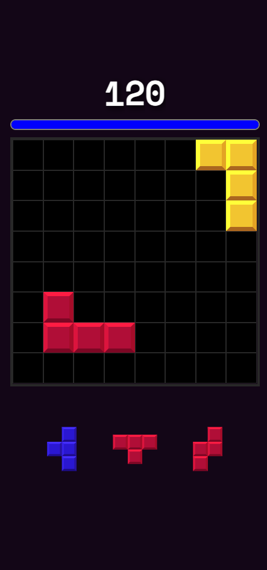

# blockerino: 8x8 grid, break lines!
Blockerino is a web and mobile Block Blast-style puzzle game where you place blocks on an 8x8 grid and clear lines to score points.

Plan your moves carefully and aim for high scores!

#### In-game screenshot
</img>
### Installation
For clarity: blockerino uses **Expo** for its React Native tooling and environment.
1. Clone the repo
```bash
git clone https://github.com/tokaa1/blockerino.git
```
2. Install dependencies
```bash
npm install
```
3. Run the dev server
```bash
npm start
```
Demoing on mobile requires the **Expo Go** app.

Don't have Expo Go? You can try it on the web aswell! Press `w` while in the development server to open blockerino in your browser.